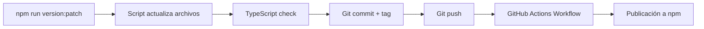

# Contributing to expo-firebase-auth

## 🚀 Gestión de Versiones

Este proyecto usa un sistema automatizado de versionado que mantiene sincronizados:
- `package.json` (versión del paquete npm)
- `.github/workflows/publish.yml` (variables de entorno para el workflow)
- Git tags

### Scripts de Versionado

Usa los siguientes comandos para incrementar la versión:

```bash
# Incrementar versión patch (1.0.7 -> 1.0.8)
npm run version:patch

# Incrementar versión minor (1.0.7 -> 1.1.0)
npm run version:minor

# Incrementar versión major (1.0.7 -> 2.0.0)
npm run version:major
```

### Uso Manual de los Scripts

**En Windows (PowerShell):**
```powershell
# Versión patch
.\bump-version.ps1 patch

# Con mensaje personalizado
.\bump-version.ps1 patch "Fix Google Auth validation"

# Versión minor
.\bump-version.ps1 minor "Add Facebook authentication"

# Versión major
.\bump-version.ps1 major
```

**En Linux/Mac:**
```bash
# Dar permisos de ejecución (solo la primera vez)
chmod +x bump-version.sh

# Versión patch
./bump-version.sh patch

# Con mensaje personalizado
./bump-version.sh patch "Fix Google Auth validation"

# Versión minor
./bump-version.sh minor "Add Facebook authentication"

# Versión major
./bump-version.sh major
```

### ¿Qué Hace el Script?

El script automáticamente:

1. ✅ **Valida** que estés en la rama `main`
2. ✅ **Verifica** que TypeScript compile sin errores
3. 📝 **Actualiza** `package.json` con la nueva versión
4. 📝 **Actualiza** `.github/workflows/publish.yml` con las variables de versión
5. 📦 **Crea commit** con mensaje descriptivo
6. 🏷️ **Crea tag** de git (ej: `v1.0.8`)
7. 🚀 **Sube** los cambios y el tag a GitHub
8. ⚡ **Dispara** automáticamente el workflow de publicación a npm

### Flujo de Publicación



### Notas Importantes

- 🚫 **NO actualices manualmente** la versión en `package.json` o el workflow YAML
- 🚫 **NO crees tags manualmente** con `git tag`
- ✅ **SÍ usa siempre** los scripts de versionado
- ✅ El workflow de GitHub Actions se ejecuta automáticamente tras el push

### Troubleshooting

**Si olvidaste usar el script y ya hiciste cambios manuales:**

1. Revierte los cambios:
   ```bash
   git reset --hard HEAD~1  # Deshace el último commit
   git tag -d v1.0.X        # Elimina el tag local
   git push origin :refs/tags/v1.0.X  # Elimina el tag remoto (si lo subiste)
   ```

2. Usa el script correctamente:
   ```bash
   npm run version:patch
   ```

**Si el workflow falla en GitHub Actions:**

- Verifica que el `NPM_TOKEN` esté configurado en los secrets del repositorio
- Revisa los logs del workflow en GitHub Actions
- Asegúrate de que la versión no exista ya en npm

## 📝 Development Workflow

### Setup

1. Clonar el repositorio:
   ```bash
   git clone https://github.com/javideveloper1985/firebase-auth-lib.git
   cd firebase-auth-lib
   ```

2. Instalar dependencias:
   ```bash
   npm install
   ```

3. Verificar TypeScript:
   ```bash
   npm run typecheck
   ```

### Hacer Cambios

1. Crea una rama para tu feature/fix:
   ```bash
   git checkout -b feature/mi-nueva-feature
   ```

2. Haz tus cambios

3. Verifica que TypeScript compile:
   ```bash
   npm run typecheck
   ```

4. Commit y push:
   ```bash
   git add .
   git commit -m "feat: descripción de mi feature"
   git push origin feature/mi-nueva-feature
   ```

5. Crea un Pull Request a `main`

6. Una vez mergeado en `main`, usa el script de versionado:
   ```bash
   git checkout main
   git pull
   npm run version:patch
   ```

## 📚 Convenciones

### Mensajes de Commit

Seguimos [Conventional Commits](https://www.conventionalcommits.org/):

- `feat:` - Nueva funcionalidad
- `fix:` - Corrección de bugs
- `docs:` - Cambios en documentación
- `style:` - Formato, espacios, etc (sin cambios de código)
- `refactor:` - Refactorización de código
- `test:` - Añadir o corregir tests
- `chore:` - Tareas de mantenimiento (build, dependencies, versioning)

### Versionado Semántico

Seguimos [Semantic Versioning](https://semver.org/):

- **MAJOR** (1.0.0 -> 2.0.0): Cambios incompatibles con versiones anteriores
- **MINOR** (1.0.0 -> 1.1.0): Nueva funcionalidad compatible hacia atrás
- **PATCH** (1.0.0 -> 1.0.1): Correcciones de bugs compatibles hacia atrás

## 🤝 Pull Requests

Antes de enviar un PR:

1. ✅ Asegúrate de que TypeScript compile sin errores
2. ✅ Prueba tu código en un proyecto real
3. ✅ Actualiza la documentación si es necesario
4. ✅ Sigue las convenciones de código existentes
5. ✅ Escribe mensajes de commit descriptivos

## 📄 License

MIT © Javier Hidalgo
